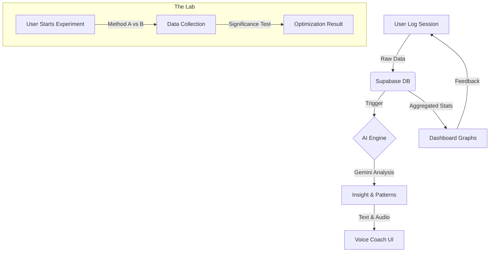

# MetaLearn AI: System Architecture & Feature Deep Dive

**MetaLearn AI** is not just a study timer—it is a **Computational Meta-Learning System**. It uses AI to analyze *how* you learn, not just *what* you learn, to optimize your cognitive performance.

---

## 🔄 The "Meta-Learning Loop" (How it Works)

The app operates on a closed feedback loop designed to improve learning velocity over time:

1.  **Input (The Sensor)**: The user logs a session (Time, Topic, Confidence, Error Count).
2.  **Processing (The Engine)**:
    *   **Statistical**: Logic aggregates data to calculate "Learning Velocity" (Confidence gained per minute).
    *   **AI Analysis**: The **Gemini Pro** LLM analyzes the session text (reflection) to detect cognitive states (e.g., "Flow State", "Cognitive Overload", "Passive Learning").
3.  **Output (The Coach)**:
    *   **Quantitative**: Graphs update to show the "Forgetting Curve" and retention rates.
    *   **Qualitative**: The **Voice Coach** speaks personalized advice (e.g., *"You are rushing. Slow down and use Active Recall."*).
4.  **Optimization (The Lab)**:
    *   The user notices a plateau.
    *   They start an **Experiment** (e.g., *Pomodoro vs. Deep Work*).
    *   Data collects separately to scientifically prove which method works better for *their* brain.


### 📊 Visual Workflow (The Loop)



---

## 📂 Project File Structure

```
Metalearn-AI/
├── pages/
│   ├── api/                  # Backend Endpoints
│   │   ├── dashboard-data.js # Aggregates Stats
│   │   ├── experiments.js    # A/B Test Logic
│   │   └── generate-coaching # Gemini AI Interface
│   ├── dashboard.js          # Main User Hub
│   ├── experiments.js        # The Lab (Gamification)
│   ├── log-session.js        # Data Entry
│   └── _app.js               # Global Layout & PWA
├── components/
│   ├── VoiceCoachingPlayer   # Visualizer & TTS
│   ├── LearningVector        # Stat Cards
│   └── SessionLogger         # Forms
├── lib/
│   └── supabaseClient.js     # DB Connection
├── public/
│   ├── manifest.json         # PWA Config
│   └── icon.svg              # App Icon
└── schema.sql                # Database Schema
```

---

## 🧩 Component Feature Breakdown

### 1. Dashboard (`dashboard.js`)
**The "Command Center"**
*   **Dynamic Greeting**: Welcomes the user as "Scholar" and updates based on time of day.
*   **Learning Vector Grid**: Displays 4 key metrics that define the user's "Learning DNA":
    *   *Learning Speed*: How fast confidence increases per minute of study.
    *   *Retention*: Calculated based on frequency of sessions and gap between them.
    *   *Consistency*: A score (0-100%) tracking daily streak adherence.
    *   *Error Recovery*: Tracks how often "Errors Made" leads to a successful subsequent session.
*   **Mobile Awareness**: Automatically switches to a "FAB" (Floating Action Button) layout on phones for cleaner UI.

### 2. Session Logger (`log-session.js`)
**The "Data Ingest Point"**
*   **Cognitive Load tracking**: Asks for "Confidence Score" (1-5) and "Did you make errors?". This is crucial for calculating the "Zone of Proximal Development".
*   **Reflection Field**: A text area for the user to type *how* they felt. This text is sent to the AI to detect nuances like "frustration" or "boredom".

### 3. Voice Coaching Player (`VoiceCoachingPlayer.jsx`)
**The "AI Interface"**
*   **Visualizer**: Uses a CSS-based animation to mimic a localized waveform, creating a "living" AI presence.
*   **Text-to-Speech (TTS)**:
    *   *Free Tier*: Uses the browser's `SpeechSynthesis` API to speak the insight.
    *   *Premium Tier (Ready)*: Architecture is ready to switch to **ElevenLabs** API for hyper-realistic voices.
*   **Insight Display**: Shows the text transcript and the specific "Pattern Detected" (e.g., *Pattern: Rote Memorization - Inefficient*).

### 4. The Lab (`experiments.js`)
**The "Gamification Engine"** (Scientific Approach)
*   **A/B Testing Framework**: Allows the user to run "Split Tests" on their life.
    *   *Variable A*: e.g., "Studying in Morning".
    *   *Variable B*: e.g., "Studying at Night".
*   **Real-time Statistical Significance**: As the user logs data, the bar charts update instantly.
*   **Hypothesis Tracking**: Stores the user's initial guess ("Hypothesis") to compare against actual results.

### 5. Insights Engine (`insights.js` + `api/generate-coaching`)
**The "Brain" (Gemini AI)**
*   **Prompt Engineering**: Takes the raw session data and wraps it in a "Pedagogical Prompt".
    *   *Prompt Logic*: "You are an elite cognitive science coach. Analyze this session: '{Topic}' with confidence '{Score}'. Is the user overconfident? Are they struggling? Be brief and actionable."
*   **Pattern Recognition**: The AI tags the session with a specific label (e.g., "Review Needed", "Mastery Achieved").

### 6. Progress Timeline (`ProgressTimeline.jsx` + `progress.js`)
**The "Long-term Memory"**
*   **Recharts Visualization**: Renders a smooth interactive line chart of confidence over time.
*   **Time Filtering**: Supports 7-Day, 30-Day, and All-Time views to show short-term sprints vs. long-term growth.
*   **Subject Isolation**: Can separate "Physics" confidence from "Math" confidence to show domain-specific strengths.

---

## 📱 Mobile Architecture (PWA)
*   **Service Workers**: `next-pwa` caches the app shell, allowing it to load instantly even on flaky networks.
*   **Manifest**: Defines the app as "Standalone" display mode (removes browser URL bar).
*   **Touch Optimization**: Buttons are sized for thumbs (min 44px touch targets).

---
*Documentation generated by Antigravity Agent for MetaLearn AI.*
